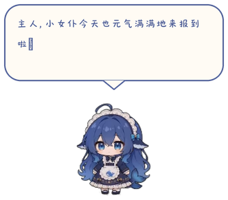

# 蓝色大肥鱼桌宠 / Big Blue Fish Desktop Pet

一只内置 4B 本地大模型的 Windows AI 桌面宠物。蓝色大肥鱼会结合天气、科技新闻和当前使用的应用，以女仆人设弹出文字气泡，温柔地陪主人工作与休息。提供一键安装，自动配置模型与运行环境。

蓝色大肥鱼是一只可爱的 Windows 桌宠软件，形象来自“蓝色大肥鱼”的二创设定。她有一身柔软的蓝色长发和小小的鲸鱼尾巴，穿着整洁的女仆裙，头顶的发饰、围裙和轻轻摇动的尾巴，让她看起来像一位住进电脑里的小女仆。她会安静地待在桌面边缘，也会在主人忙碌时探头、挥手、伸展或开心地蹦起来，用小小的动作陪着主人工作。

她不是一个冷冰冰的工具，而是一只会在桌面上生活的蓝色大肥鱼。她会记得自己的女仆身份，喜欢用亲近、温柔又有一点俏皮的语气向主人问候；当主人深夜还在敲代码、天气变冷或工作时间很长时，她会从气泡里送来一句轻轻的关心。她的表达会随着本轮读取到的天气、科技新闻和当前工作环境变化，每次生成一小段新的话。

蓝色大肥鱼内置 4B 本地模型，可以联网读取天气、科技新闻和用户当前的工作内容，再以女仆人设在电脑里弹出聊天气泡，温柔可爱地表达对用户的关心。模型只进行单次输出，没有对话记忆，也不能与用户连续聊天。用户在电脑上的行为不会被上传到云端，也不会被保存到本地。

桌宠内置多种可爱的动作和表情，会轮流播放等待、开心、害羞、睡觉、伸展、挥手等动作。笔记本电脑离开电源时，桌宠可以自动停止模型推理并将模型移出内存，以改善续航；这个行为也可以在设置中调整。

<p align="center">
  
  
</p>

## 一键安装

普通用户请从 GitHub Releases 下载：

```text
BigBlueFish-Setup-x64.exe
```

双击安装器即可开始部署。安装器会把桌宠程序、动画资源、.NET 运行时和本地推理运行时安装到电脑中，并从固定版本的 Hugging Face 来源下载约 2.7 GB 的 4B 模型。模型下载完成后，安装器会校验 SHA-256，校验通过后完成安装并启动桌宠。

模型下载源是：

```text
https://huggingface.co/Biomanticus/Qwen3.5-4B-heretic-gguf/resolve/b63ff4662e4863cfa005c9cd8ed34b87ed44b7e1/Qwen3.5-4B-heretic-f16_Q4_K_M.gguf?download=true
```

模型文件名为 `Qwen3.5-4B-heretic-Q4_K_M.gguf`，SHA-256 为：

```text
8485535a36c9f333574d08b650ad698ac02ec30752bd9cd87e493a3b7531bee1
```

## 从仓库部署

仓库面向开发者和维护者，包含源码、动画资源、地区数据、构建脚本、发布脚本、测试程序、依赖锁文件和许可文件。仓库不包含模型权重、运行时二进制、用户设置、缓存、日志或本地发布包。

在 Windows x64 环境中安装 .NET 10 SDK 后，可以从仓库根目录执行：

```powershell
./code/build.ps1 -Locked
```

构建一键安装器需要一个已经核对过的 llama.cpp 运行时目录：

```powershell
./tools/Build-Installer.ps1 -Version 0.1.0 -RuntimeDirectory "运行时目录"
```

安装器自身携带桌宠程序和运行时；模型由安装器在安装过程中从固定来源下载，不会被写入 Git 仓库。

## 天气、科技新闻和桌宠行为

蓝色大肥鱼支持省、市、县区三级天气地点选择。天气内容根据用户选择的地区读取，再由本地模型组织成女仆人设的聊天气泡。自动公开信息可以在设置中调整，桌宠也可以播放科技新闻标题，并围绕当前使用的电脑环境表达关心。

## 更新日志

版本变化记录在 [CHANGELOG.md](CHANGELOG.md) 中。GitHub Release 页面会提供对应版本的安装器和版本说明。

## 开源许可与权利信息

本项目使用的源码、动画、推理运行时、模型、地区数据和天气数据分别来自不同项目，具体来源、许可和版权说明见 [LICENSE](LICENSE)、[第三方声明](code/THIRD-PARTY.md) 和 [许可文件目录](code/licenses)。蓝色大肥鱼是基于 VPet 和社区素材制作的定制桌宠项目，不代表 VPet、DeepSeek、Qwen、llama.cpp 或其他来源项目的官方产品。

## 项目结构

`code/` 保存 C#、XAML、动画、地区数据、测试程序和依赖锁文件；`installer/` 保存一键安装器的源码；`tools/` 保存构建发布与模型配置工具；`docs/` 保存项目功能规格、维护交接说明和 README 图片；`release/` 保存发布说明模板。

## 开发与维护

如果你希望修改桌宠行为、增加动作、调整天气逻辑或改进模型交互，请先阅读 [AGENTS.md](AGENTS.md)、[完整功能规格](docs/AGENT_FUNCTIONAL_SPEC.md) 和 [本地 Git 交接说明](docs/LOCAL_GIT_HANDOFF.md)。欢迎通过 GitHub Issues 提交问题、改进建议和使用反馈。
